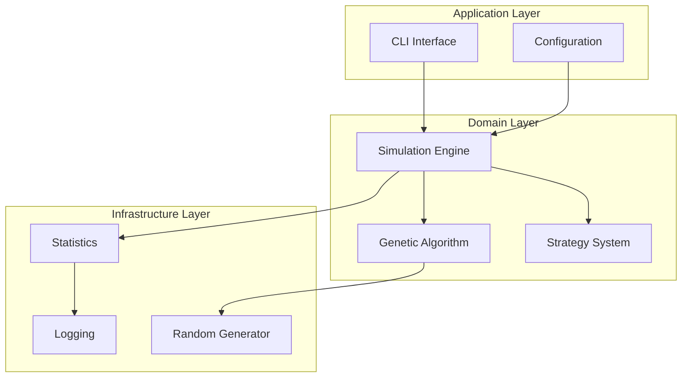
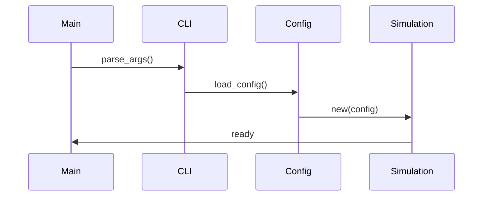
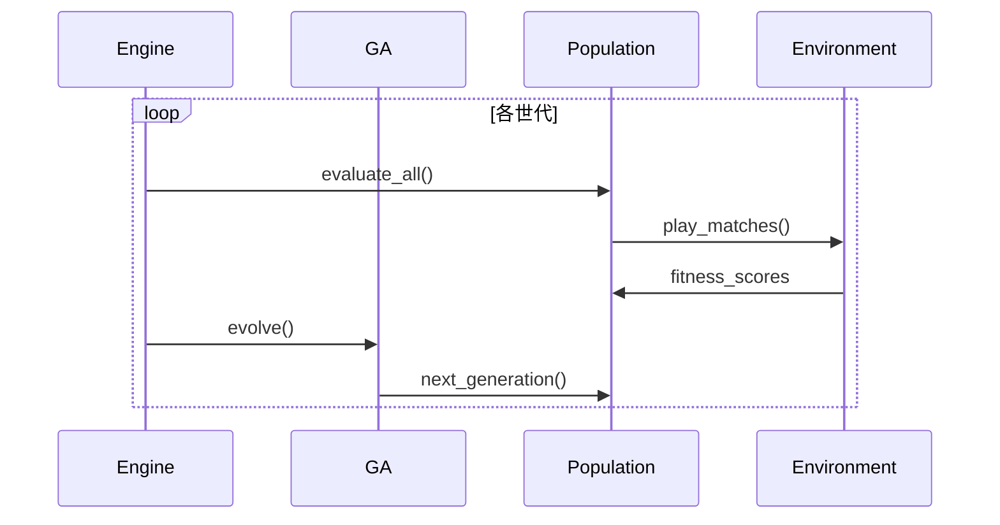
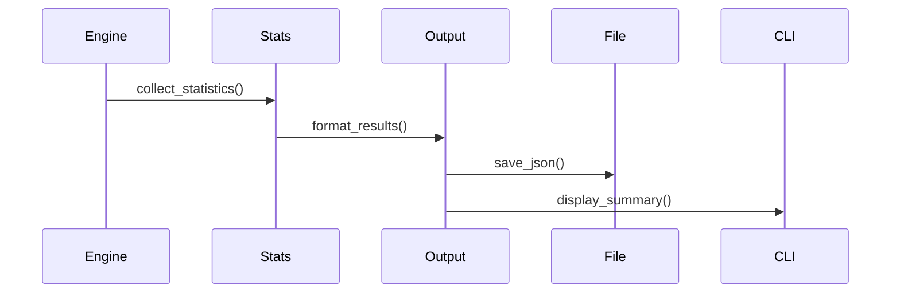

# アーキテクチャガイド

このドキュメントでは、GA Prisoner's Dilemmaプロジェクトの内部アーキテクチャ、設計思想、実装詳細について説明します。

## アーキテクチャ概要

### 設計原則

1. モジュラー設計: 各機能を独立したモジュールとして実装
2. 単一責任: 各モジュールは明確な責任を持つ
3. 依存性注入: 設定可能で テスタブルな設計
4. エラーハンドリング: anyhowによる統一的なエラー処理
5. 非同期処理: tokioによる並行実行
6. 型安全性: Rustの型システムを活用した堅牢性

### 全体構造



## モジュール詳細

### Core Module (`src/core/`)

責任: 基盤機能とユーティリティの提供

#### `logging.rs` - ロギングシステム

```rust
/// ロギング設定
pub struct LogConfig {
    pub level: LogLevel,
    pub json_format: bool,
    pub include_spans: bool,
    pub file_output: bool,
    pub file_path: Option<PathBuf>,
}

/// ロギング初期化
pub fn init_logging(config: &LogConfig) -> Result<()>
```

特徴:
- tracing/tracing-subscriberベース
- 構造化ログ対応
- 開発/本番環境の使い分け
- パフォーマンス測定マクロ

#### `random.rs` - 乱数生成

```rust
/// SFMT高速乱数生成器
pub struct RandomGenerator {
    sfmt: Mutex<SFMT>,
}

impl RandomGenerator {
    pub fn new(seed: Option<u32>) -> Self
    pub fn gen_f64(&self) -> Result<f64>
    pub fn gen_range(&self, max: usize) -> Result<usize>
    pub fn choose<'a, T>(&self, items: &'a [T]) -> Result<&'a T>
}
```

技術選択:
- SFMT: 高速なMersenne Twister変種
- スレッドセーフ: Mutexによる並行アクセス対応
- シード固定: 再現可能な実験のサポート

#### `types.rs` - 型定義

```rust
/// 基本型エイリアス
pub type Population = usize;
pub type Generation = usize;
pub type Fitness = f64;
pub type MutationRate = f64;

/// エージェントID
#[derive(Debug, Clone, Copy, PartialEq, Eq, Hash)]
pub struct AgentId(pub usize);

/// DNA配列
#[derive(Debug, Clone, PartialEq)]
pub struct DNA(pub Vec<bool>);
```

#### `validation.rs` - バリデーション

```rust
/// 共通バリデーション関数
pub fn validate_population_size(size: Population) -> Result<()>
pub fn validate_mutation_rate(rate: MutationRate) -> Result<()>
pub fn validate_probability(prob: f64) -> Result<()>
```

### Configuration Module (`src/config/`)

責任: 設定の読み込み、検証、管理

#### `schema.rs` - 設定スキーマ

```rust
/// メイン設定構造体
#[derive(Debug, Clone, Serialize, Deserialize)]
pub struct Config {
    pub genetic: GeneticConfig,
    pub simulation: SimulationConfig,
    pub output: OutputConfig,
    pub performance: PerformanceConfig,
}

/// 遺伝的アルゴリズム設定
#[derive(Debug, Clone, Serialize, Deserialize)]
pub struct GeneticConfig {
    pub population_size: usize,
    pub generations: usize,
    pub mutation_rate: f64,
    pub elite_count: usize,
    pub dna_length: usize,
    pub crossover_type: CrossoverType,
    pub selection_method: SelectionMethod,
}
```

設計特徴:
- Serde統合: TOML/YAML/JSON自動対応
- デフォルト値: `#[serde(default)]`による設定
- バリデーション: 設定値の妥当性チェック
- 型安全: enumによる設定選択肢の制限

#### `loader.rs` - 設定ローダー

```rust
/// 設定ファイルローダー
pub struct ConfigLoader {
    search_paths: Vec<PathBuf>,
}

impl ConfigLoader {
    pub fn new() -> Self
    pub fn load(&self, path: Option<&Path>) -> Result<Config>
    pub fn save(config: &Config, path: &Path) -> Result<()>
    pub fn find_config_path(&self) -> Option<PathBuf>
}
```

機能:
- 自動検索: 複数パスでの設定ファイル検索
- 形式判定: 拡張子による形式自動判定
- 階層マージ: デフォルト → ユーザー → コマンドライン

### CLI Module (`src/cli/`)

責任: コマンドライン インターフェースの実装

#### `app.rs` - アプリケーション定義

```rust
/// メインCLI構造体
#[derive(Parser, Debug)]
pub struct Cli {
    #[command(subcommand)]
    pub command: Commands,
    
    #[arg(short, long, global = true)]
    pub config: Option<PathBuf>,
    
    #[arg(short = 'v', long, global = true)]
    pub log_level: String,
    
    #[arg(short, long, global = true)]
    pub quiet: bool,
}

/// サブコマンド定義
#[derive(Subcommand, Debug)]
pub enum Commands {
    Run(RunArgs),
    Config { action: ConfigAction },
    Init { output: Option<PathBuf>, format: ConfigFormat },
    Strategies { detailed: bool },
    Benchmark { args: BenchmarkArgs },
}
```

clap v4活用:
- Derive API: 型安全なCLI定義
- サブコマンド: 階層的なコマンド構造
- グローバルオプション: 全コマンド共通設定
- バリデーション: 自動的な引数検証

#### `commands/` - コマンド実装

各コマンドは独立したモジュールとして実装：

```rust
// run.rs
pub async fn handle_run_command(args: RunArgs) -> Result<()>

// config.rs  
pub async fn execute_config(action: ConfigAction) -> Result<()>

// init.rs
pub async fn execute_init(output: Option<PathBuf>, format: ConfigFormat) -> Result<()>
```

### Genetic Module (`src/genetic/`)

責任: 遺伝的アルゴリズムの核心実装

#### `individual.rs` - 個体管理

```rust
/// 遺伝的アルゴリズムの個体
#[derive(Debug, Clone)]
pub struct Individual {
    id: AgentId,
    dna: DNA,
    fitness: f64,
    generation: usize,
}

impl Individual {
    pub fn new(id: AgentId, dna_length: usize) -> Self
    pub fn choose(&self, opponent_history: &[Choice], round: usize) -> Result<Choice>
    pub fn mutate(&mut self, rate: f64) -> Result<()>
    pub fn crossover(&self, other: &Individual) -> Result<(Individual, Individual)>
}
```

設計ポイント:
- 不変性: IDと世代は変更不可
- 適応度: 遅延計算とキャッシュ
- 戦略決定: DNAから行動への変換ロジック

#### `population.rs` - 個体群管理

```rust
/// 個体群
#[derive(Debug, Clone)]
pub struct Population {
    individuals: Vec<Individual>,
    generation: usize,
    statistics: PopulationStats,
}

impl Population {
    pub fn new(size: usize, dna_length: usize) -> Result<Self>
    pub fn evolve(&mut self, config: &GeneticConfig) -> Result<()>
    pub fn best_individual(&self) -> Option<&Individual>
    pub fn diversity(&self) -> f64
}
```

#### `algorithm.rs` - GA エンジン

```rust
/// 遺伝的アルゴリズムエンジン
pub struct GeneticAlgorithm {
    config: GeneticConfig,
    current_generation: usize,
    population: Population,
}

impl GeneticAlgorithm {
    pub fn new(config: GeneticConfig) -> Result<Self>
    pub fn evolve(&mut self) -> Result<()>
    pub fn population(&self) -> &Population
}
```

進化ステップ:
1. 評価: 適応度計算
2. 選択: 親個体の選択
3. 交叉: 新個体生成
4. 突然変異: 遺伝的多様性確保
5. 世代交代: エリート保存

#### `operations.rs` - 遺伝的操作

```rust
/// 選択方法
#[derive(Debug, Clone)]
pub enum SelectionMethod {
    Tournament(usize),
    Roulette,
    Rank,
}

/// 交叉方法
#[derive(Debug, Clone)]
pub enum CrossoverType {
    SinglePoint,
    TwoPoint,
    Uniform,
}

pub fn tournament_selection(population: &Population, size: usize) -> Result<&Individual>
pub fn single_point_crossover(parent1: &Individual, parent2: &Individual) -> Result<(Individual, Individual)>
```

### Simulation Module (`src/simulation/`)

責任: シミュレーション実行とゲーム環境管理

#### `environment.rs` - ゲーム環境

```rust
/// 囚人のジレンマの選択
#[derive(Debug, Clone, Copy, PartialEq, Eq)]
pub enum Choice {
    Cooperate,
    Defect,
}

/// ゲーム環境
#[derive(Debug, Clone)]
pub struct Environment {
    pub payoff_matrix: PayoffMatrix,
    pub rounds_per_match: usize,
    pub noise_level: f64,
    pub information_completeness: f64,
}
```

#### `engine.rs` - シミュレーション エンジン

```rust
/// メインシミュレーションエンジン
pub struct Simulation {
    config: Config,
    environment: Environment,
    genetic_algorithm: GeneticAlgorithm,
    rng: RandomGenerator,
    current_generation: usize,
    generation_history: Vec<GenerationStats>,
}

impl Simulation {
    pub fn new(config: Config, seed: Option<u32>) -> Result<Self>
    pub async fn run(&mut self) -> Result<SimulationStats>
    pub fn set_progress_callback(&mut self, callback: Box<dyn Fn(usize, &GenerationStats) + Send + Sync>)
}
```

実行フロー:
1. 初期化: 個体群と環境の生成
2. 評価: 総当たり戦実行
3. 進化: 遺伝的アルゴリズム適用
4. 記録: 統計データ収集
5. 収束判定: 停止条件チェック

#### `runner.rs` - 実行管理

```rust
/// 複数実行の管理
pub struct SimulationRunner {
    base_config: Config,
    results: HashMap<String, SimulationStats>,
}

impl SimulationRunner {
    pub async fn run_single(&mut self, name: String, config: Option<Config>, seed: Option<u32>) -> Result<SimulationStats>
    pub async fn run_multiple(&mut self, base_name: &str, runs: usize, config_override: Option<Config>) -> Result<Vec<(String, SimulationStats)>>
    pub async fn run_parameter_sweep(&mut self, base_name: &str, parameter_variations: Vec<(&str, Vec<ParameterValue>)>, seed: Option<u32>) -> Result<Vec<(String, SimulationStats)>>
}
```

#### `stats.rs` - 統計処理

```rust
/// 世代統計
#[derive(Debug, Clone, Serialize, Deserialize)]
pub struct GenerationStats {
    pub generation: usize,
    pub avg_fitness: f64,
    pub max_fitness: f64,
    pub min_fitness: f64,
    pub std_fitness: f64,
    pub diversity: f64,
    pub elapsed_ms: u64,
}

/// シミュレーション全体統計
#[derive(Debug, Clone, Serialize, Deserialize)]
pub struct SimulationStats {
    pub generation_history: Vec<GenerationStats>,
    pub best_individual: BestIndividualInfo,
    pub convergence_info: ConvergenceInfo,
    pub performance_info: PerformanceInfo,
}
```

### Strategies Module (`src/strategies/`)

責任: 戦略の実装と管理

```rust
/// 戦略トレイト
pub trait Strategy {
    fn name(&self) -> &str;
    fn description(&self) -> &str;
    fn decide(&self, history: &[(Choice, Choice)], round: usize) -> Choice;
}

/// 基本戦略実装
#[derive(Clone, Debug)]
pub enum BasicStrategy {
    AlwaysCooperate,
    AlwaysDefect,
    TitForTat,
    Random,
}

/// 戦略セレクター
pub struct StrategySelector;
impl StrategySelector {
    pub fn available_strategies() -> Vec<BasicStrategy>
    pub fn get_strategy(name: &str) -> Option<BasicStrategy>
}
```

## データフロー

### 1. アプリケーション起動



### 2. シミュレーション実行



### 3. 結果出力



## 実装技術

### エラーハンドリング戦略

```rust
// anyhowによる統一的エラー処理
pub type Result<T> = anyhow::Result<T>;

// コンテキスト付きエラー
config.validate()
    .with_context(|| format!("設定ファイルの検証に失敗: {}", path.display()))?;

// エラーチェーン
fn load_and_validate(path: &Path) -> Result<Config> {
    let config = Config::from_file(path)
        .context("設定ファイルの読み込みに失敗")?;
    
    config.validate()
        .context("設定の検証に失敗")?;
    
    Ok(config)
}
```

### 非同期処理

```rust
// tokioランタイム
#[tokio::main]
async fn main() -> Result<()> {
    // 非同期シミュレーション実行
    let stats = simulation.run().await?;
    Ok(())
}

// 並列処理（将来実装）
async fn parallel_evaluation(&mut self) -> Result<()> {
    let futures: Vec<_> = self.population.individuals()
        .iter()
        .map(|individual| async move {
            self.evaluate_individual(individual).await
        })
        .collect();
    
    let results = futures::future::join_all(futures).await;
    // 結果の統合
    Ok(())
}
```

### メモリ管理

```rust
// スマートポインタの活用
pub struct Simulation {
    population: Arc<RwLock<Population>>,  // 共有参照
    config: Arc<Config>,                   // 不変共有
}

// Clone-on-Write for 効率的なコピー
pub struct Population {
    individuals: Cow<'static, [Individual]>,
}
```

### 型安全性

```rust
// newtype pattern
#[derive(Debug, Clone, Copy)]
pub struct Generation(pub usize);

#[derive(Debug, Clone, Copy)]  
pub struct PopulationSize(pub usize);

// Phantom types for compile-time safety
pub struct Config<T> {
    inner: ConfigInner,
    _marker: PhantomData<T>,
}

pub struct Validated;
pub struct Unvalidated;

pub type ValidatedConfig = Config<Validated>;
pub type UnvalidatedConfig = Config<Unvalidated>;
```

## テストアーキテクチャ

### テスト分類

```
tests/
├── unit/           # 単体テスト
│   ├── genetic/    # GA機能テスト
│   ├── config/     # 設定機能テスト
│   └── strategies/ # 戦略テスト
├── integration/    # 統合テスト
│   ├── cli/        # CLIテスト
│   ├── simulation/ # シミュレーションテスト
│   └── e2e/        # End-to-Endテスト
└── benchmarks/     # ベンチマーク
    ├── performance/# パフォーマンステスト
    └── memory/     # メモリ使用量テスト
```

### テスト戦略

```rust
// プロパティベーステスト
#[cfg(test)]
mod tests {
    use proptest::prelude::*;
    
    proptest! {
        #[test]
        fn population_fitness_never_decreases(
            initial_fitness in 0.0f64..10.0,
            generations in 1usize..100
        ) {
            let mut population = create_test_population(initial_fitness);
            let initial_max = population.max_fitness();
            
            for _ in 0..generations {
                population.evolve(&default_config())?;
                prop_assert!(population.max_fitness() >= initial_max);
            }
        }
    }
}
```

## パフォーマンス考慮事項

### 最適化ポイント

1. メモリアロケーション: 事前確保とプールの活用
2. CPU効率: SIMD命令とベクトル化
3. 並列処理: rayonによるデータ並列
4. キャッシュ効率: データ局所性の最適化

### プロファイリング

```bash
# CPU プロファイリング
cargo flamegraph --bin ga-sim -- run --generations 1000

# メモリプロファイリング  
valgrind --tool=massif target/release/ga-sim run --generations 1000

# ベンチマーク
cargo bench
```

## 将来の拡張計画

### アーキテクチャの発展

1. プラグインシステム: 戦略の動的読み込み
2. 分散処理: 複数ノードでの並列実行
3. リアルタイム可視化: WebAssemblyとWebUI
4. 機械学習統合: 戦略の自動最適化

### 技術的改善

1. ゼロコピー最適化: 不要なデータコピーの排除
2. SIMD活用: 並列計算の高速化
3. GPU計算: CUDA/OpenCLサポート
4. メモリマップ: 大規模データの効率的処理

---

このアーキテクチャは進化し続けており、パフォーマンス、保守性、拡張性のバランスを取りながら改善されています。具体的な実装例は[EXAMPLES.md](EXAMPLES.md)、戦略の詳細は[STRATEGIES.md](STRATEGIES.md)を参照してください。