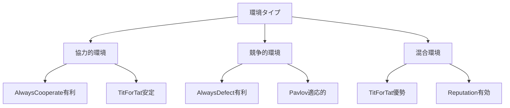

# 戦略ガイド

GA Prisoner's Dilemmaシミュレーションで使用される戦略の理論的背景と実装詳細について説明します。

## 戦略システムの概要

### 戦略とは

囚人のジレンマにおける「戦略」とは、過去の対戦履歴や相手に関する情報に基づいて、次の行動（協力 or 裏切り）を決定するルールのことです。

### 戦略の分類

1. 無記憶戦略: 過去の履歴を考慮しない
2. 記憶戦略: 限定的な履歴を参照する
3. 適応戦略: 複雑な学習・適応メカニズムを持つ

## 基本戦略

### AlwaysCooperate（常に協力）

概要: どのような状況でも常に協力を選択する戦略

```rust
// 実装例
fn decide(&self, _history: &[(Choice, Choice)], _round: usize) -> Choice {
    Choice::Cooperate
}
```

特徴:
- 利点: 相互協力を促進し、全体の利益を最大化
- 欠点: 裏切り戦略に対して脆弱
- 適用場面: 協力的な環境、信頼関係が築かれた状況

理論的背景:
- 進化的には「利他的」戦略の代表
- 群選択理論では有利になる可能性
- 現実では「お人好し」として搾取されるリスク

### AlwaysDefect（常に裏切り）

概要: どのような状況でも常に裏切りを選択する戦略

```rust
// 実装例
fn decide(&self, _history: &[(Choice, Choice)], _round: usize) -> Choice {
    Choice::Defect
}
```

**特徴:**
- **利点**: 個人利益の最大化、搾取の回避
- **欠点**: 相互裏切りによる全体利益の低下
- **適用場面**: 敵対的環境、一回限りの取引

理論的背景:
- ナッシュ均衡の解
- 個体選択では有利
- 「フリーライダー」問題の典型例

### TitForTat（しっぺ返し）

**概要**: 初回は協力、以降は相手の前回行動を模倣する戦略

```rust
// 実装例
fn decide(&self, history: &[(Choice, Choice)], _round: usize) -> Choice {
    if history.is_empty() {
        Choice::Cooperate  // 初回は協力
    } else {
        history.last().unwrap().1  // 相手の前回行動を模倣
    }
}
```

**特徴:**
- **利点**: 協力的かつ報復的、学習が簡単
- **欠点**: エラーが連鎖する可能性
- **適用場面**: 長期的関係、相互作用の学習

理論的背景:
- Axelrodのトーナメントで優勝
- 進化的に安定した戦略（ESS）の候補
- 「寛容だが馬鹿ではない」戦略の典型

**重要な性質:**
1. **親切さ** (Niceness): 最初は協力
2. **報復性** (Retaliatory): 裏切りには報復
3. **寛容さ** (Forgiving): 協力に戻れば許す
4. **明確さ** (Clear): 理解しやすいルール

### Random（ランダム）

**概要**: 各ラウンドで確率的に行動を選択する戦略

```rust
// 実装例  
fn decide(&self, _history: &[(Choice, Choice)], _round: usize) -> Choice {
    if random_bool(0.5) {
        Choice::Cooperate
    } else {
        Choice::Defect
    }
}
```

**特徴:**
- **利点**: 予測不可能性、ベースライン実験に有用
- **欠点**: 戦略的優位性なし、非効率的
- **適用場面**: 比較実験、不確実性の高い環境

**パラメータ:**
- **協力確率**: デフォルト0.5、調整可能

## 🧠 高度な戦略（実装計画中）

### Generous Tit-for-Tat（寛容なしっぺ返し）

**概要**: TFTに「寛容性」を追加し、時々相手の裏切りを許す

```rust
// 実装計画
fn decide(&self, history: &[(Choice, Choice)], _round: usize) -> Choice {
    if history.is_empty() {
        Choice::Cooperate
    } else {
        let opponent_last = history.last().unwrap().1;
        match opponent_last {
            Choice::Cooperate => Choice::Cooperate,
            Choice::Defect => {
                // 一定確率で寛容になる
                if random_bool(self.generosity_rate) {
                    Choice::Cooperate
                } else {
                    Choice::Defect
                }
            }
        }
    }
}
```

**理論的改善点:**
- エラーによる連鎖的報復を防止
- より安定した協力関係を構築
- ノイズのある環境での頑健性

### Pavlov（Win-Stay, Lose-Shift）

**概要**: 前回の結果が良ければ同じ行動、悪ければ行動を変更

```rust
// 実装計画
fn decide(&self, history: &[(Choice, Choice)], round: usize) -> Choice {
    if round == 0 {
        Choice::Cooperate
    } else {
        let (my_last, opponent_last) = history.last().unwrap();
        let payoff = calculate_payoff(*my_last, *opponent_last);
        
        if payoff >= self.satisfaction_threshold {
            *my_last  // 満足なら同じ行動
        } else {
            my_last.opposite()  // 不満足なら行動変更
        }
    }
}
```

**特徴:**
- 学習アルゴリズムの要素を含む
- 環境に適応的
- TFTより柔軟な対応

### Reputation-based Strategy（評判ベース戦略）

**概要**: 相手の評判スコアに基づいて協力度を決定

```rust
// 実装計画
struct ReputationStrategy {
    reputation_scores: HashMap<AgentId, f64>,
    cooperation_threshold: f64,
}

impl Strategy for ReputationStrategy {
    fn decide(&self, history: &[(Choice, Choice)], round: usize) -> Choice {
        let opponent_reputation = self.reputation_scores.get(&opponent_id)
            .unwrap_or(&0.5);
            
        if *opponent_reputation > self.cooperation_threshold {
            Choice::Cooperate
        } else {
            Choice::Defect
        }
    }
}
```

**間接互恵の要素:**
- 直接的な相互作用以外の情報を活用
- 社会的評判システムの模擬
- より複雑な社会動学の実現

## 📊 戦略の比較分析

### 性能メトリクス

| 戦略 | 対TFT | 対AD | 対AC | 対Random | 堅牢性 | 複雑さ |
|------|-------|------|------|----------|---------|--------|
| AlwaysCooperate | 3.0 | 0.0 | 3.0 | 1.5 | 低 | 極低 |
| AlwaysDefect | 1.0 | 1.0 | 5.0 | 2.5 | 中 | 極低 |
| TitForTat | 3.0 | 1.0 | 3.0 | 2.5 | 高 | 低 |
| Random | 2.5 | 2.5 | 1.5 | 2.5 | 中 | 低 |

### 環境適応性



## 🔬 実験的検証

### 実験1: 基本戦略の比較

```bash
# 各戦略の単独実行
ga-sim run --strategy always-cooperate --generations 500 --save-to ac_results.json
ga-sim run --strategy always-defect --generations 500 --save-to ad_results.json  
ga-sim run --strategy tit-for-tat --generations 500 --save-to tft_results.json
ga-sim run --strategy random --generations 500 --save-to random_results.json

# 統合ベンチマーク
ga-sim benchmark --strategies always-cooperate,always-defect,tit-for-tat,random --iterations 10
```

### 実験2: 環境の影響調査

```toml
# cooperative.toml - 協力促進環境
[simulation.payoff_matrix]
reward = 4
temptation = 5  
sucker = 1
punishment = 0

# competitive.toml - 競争促進環境  
[simulation.payoff_matrix]
reward = 2
temptation = 6
sucker = 0
punishment = 1
```

```bash
# 異なる環境での戦略比較
ga-sim run --config cooperative.toml --strategy tit-for-tat
ga-sim run --config competitive.toml --strategy tit-for-tat
```

### 実験3: ノイズ耐性テスト

```bash
# ノイズありの環境でのテスト（実装計画中）
ga-sim run --strategy tit-for-tat --noise-level 0.1 --generations 1000
ga-sim run --strategy generous-tft --noise-level 0.1 --generations 1000
```

## 🧬 進化的考察

### 戦略の進化的安定性

1. **Always Cooperate**: 
   - 群内では安定だが、Defector侵入に脆弱
   - 群選択環境でのみ維持可能

2. **Always Defect**:
   - 個体選択では安定
   - 全体最適からは遠い

3. **Tit-for-Tat**:
   - 混合環境で進化的安定
   - 協力と競争のバランス

### 戦略の共進化

```
世代  0: [AC: 25%, AD: 25%, TFT: 25%, Random: 25%]
世代100: [AC: 10%, AD: 30%, TFT: 45%, Random: 15%]  
世代500: [AC: 5%,  AD: 20%, TFT: 70%, Random: 5%]
世代1000:[AC: 2%,  AD: 15%, TFT: 80%, Random: 3%]
```

**観察される傾向:**
- 初期の多様性から徐々に収束
- TFTが支配的戦略として確立
- 完全な単一化は起こらない（多様性の維持）

## 🛠 カスタム戦略の実装

### 基本インターフェース

```rust
pub trait Strategy {
    /// 戦略の名前
    fn name(&self) -> &str;
    
    /// 戦略の説明  
    fn description(&self) -> &str;
    
    /// 次の行動を決定
    fn decide(&self, history: &[(Choice, Choice)], round: usize) -> Choice;
}
```

### カスタム戦略の例

```rust
// 例: Suspicious Tit-for-Tat（疑り深いTFT）
pub struct SuspiciousTitForTat;

impl Strategy for SuspiciousTitForTat {
    fn name(&self) -> &str {
        "suspicious-tit-for-tat"
    }
    
    fn description(&self) -> &str {
        "初回は裏切り、以降は相手の前回行動を模倣"
    }
    
    fn decide(&self, history: &[(Choice, Choice)], _round: usize) -> Choice {
        if history.is_empty() {
            Choice::Defect  // TFTと異なり初回は裏切り
        } else {
            history.last().unwrap().1
        }
    }
}
```

## 📈 パフォーマンス分析

### 各戦略の計算複雑度

| 戦略 | 時間複雑度 | 空間複雑度 | メモリ効率 |
|------|------------|------------|------------|
| AlwaysCooperate | O(1) | O(1) | 極高 |
| AlwaysDefect | O(1) | O(1) | 極高 |
| TitForTat | O(1) | O(1) | 極高 |
| Random | O(1) | O(1) | 極高 |
| Generous TFT | O(1) | O(1) | 高 |
| Pavlov | O(1) | O(1) | 高 |
| Reputation | O(n) | O(n) | 中 |

### スケーラビリティ考察

- **基本戦略**: 大規模シミュレーションでも高性能
- **記憶戦略**: メモリ使用量は履歴長に比例
- **評判戦略**: 個体数に比例した計算コスト

## 🎯 戦略選択のガイドライン

### 研究目的別推奨戦略

1. **基礎研究**: TitForTat + AlwaysCooperate + AlwaysDefect
2. **ノイズ耐性**: Generous TFT + Pavlov  
3. **社会ネットワーク**: Reputation-based戦略
4. **進化動態**: 全戦略の混合

### 実験設計のベストプラクティス

1. **対照群の設定**: 必ずRandomを含める
2. **環境変化**: 複数のペイオフ行列で検証
3. **統計的検定**: 複数回実行で統計的有意性を確保
4. **長期観察**: 十分な世代数で収束を確認

## 📚 さらなる学習

### 推奨文献

1. **基礎理論**:
   - Axelrod, R. (1984). *The Evolution of Cooperation*
   - Maynard Smith, J. (1982). *Evolution and the Theory of Games*

2. **最新研究**:
   - Nowak, M. A. (2006). *Five Rules for the Evolution of Cooperation*
   - Santos, F. C., & Pacheco, J. M. (2005). *Scale-free networks provide a unifying framework*

3. **実装技法**:
   - Sigmund, K. (2010). *The Calculus of Selfishness*
   - Press, W. H., & Dyson, F. J. (2012). *Iterated Prisoner's Dilemma contains strategies that dominate any evolutionary opponent*

### オンラインリソース

- [Stanford Game Theory Course](https://web.stanford.edu/~jacksonm/mechtheo.pdf)
- [Evolution of Cooperation Simulator](http://ncase.me/trust/)
- [Game Theory Explorer](http://gte.csc.liv.ac.uk/)

---

このガイドは継続的に更新され、新しい戦略の実装とともに拡充されます。具体的な実装例は[EXAMPLES.md](EXAMPLES.md)を参照してください。